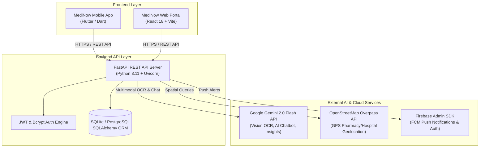
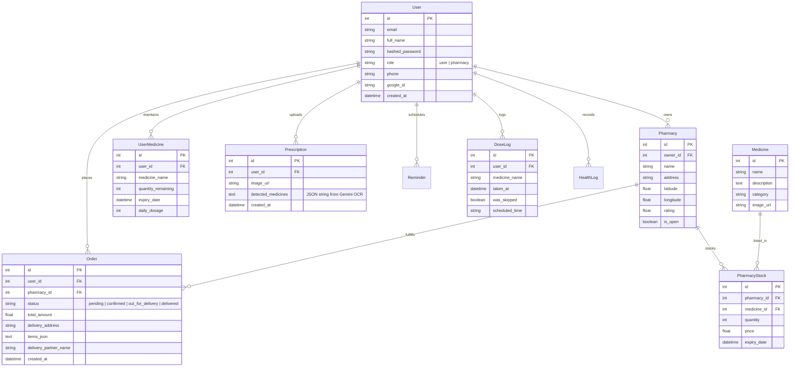

# MediNow — AI-Powered Healthcare & Pharmacy Management Platform
## Comprehensive Technical & Functional Documentation for Mentor Presentation

---

## 1. Executive Summary & Project Title

* **Project Title:** **MediNow** (Smart AI Healthcare Ecosystem & Pharmacy Network)
* **Tagline:** *Next-Generation AI Personal Health Assistant, Multimodal Prescription Vision OCR, & Real-Time Local Pharmacy Delivery Platform*
* **Target Audience:** Patients, Chronic Medication Users, Elderly Caregivers, Local Pharmacy Owners, and Healthcare Providers.

### Core Value Proposition
**MediNow** bridges the critical gap between medical prescription management, patient medication adherence, and local pharmacy access. By combining **Multimodal AI (Google Gemini 2.0 Flash)**, **real-time OpenStreetMap GPS geofencing**, and **cross-platform mobile and web interfaces**, MediNow provides an end-to-end digital health companion that:
1. Eliminates manual entry of handwritten doctor prescriptions via AI Vision OCR.
2. Tracks inventory in real-time, warning users before medicines run out or expire.
3. Quantifies medication adherence with visual charts, risk scores, and AI behavioral insights.
4. Locates nearby pharmacies/hospitals and enables direct medicine ordering with live delivery tracking.
5. Generates exportable **Clinical Doctor Summaries** for physician consultations.

---

## 2. System Architecture Overview

MediNow follows a modular **Client-Server & Cloud AI Architecture**. 



---

## 3. Technology Stack & Tooling

MediNow is constructed using modern, industry-standard frameworks and technologies categorized by application layer:

### A. Frontend Layer (Mobile & Web Applications)

| Component | Framework / Tool | Description & Purpose |
| :--- | :--- | :--- |
| **Web App Core** | React 18 + Vite | Lightning-fast Single Page Application (SPA) web frontend with hot module replacement. |
| **Web Routing** | React Router DOM v6 | Seamless client-side routing for Patient and Pharmacy multi-portal layouts. |
| **Web Styling** | Custom CSS (Glassmorphism) | Modern design tokens, vibrant gradients, dark/light theme, and dynamic micro-animations. |
| **Mobile App Core** | Flutter (Dart SDK 3.x) | Cross-platform native mobile application targeting Android, iOS, and Web. |
| **Mobile State Mgmt** | Provider | Reactive state management pattern across screens and services. |
| **Mobile Visualization**| `fl_chart` | Interactive adherence graphs, dosage compliance trends, and health log charts. |
| **Native Device Features**| `image_picker`, `flutter_local_notifications`, `geolocator`, `flutter_secure_storage` | Access to camera for scanning prescriptions, offline background reminder notifications, live GPS location, and encrypted token storage. |

### B. Backend API Layer

| Component | Framework / Tool | Description & Purpose |
| :--- | :--- | :--- |
| **API Framework** | FastAPI (Python 3.11+) | High-performance, asynchronous RESTful API framework with automatic OpenAPI/Swagger documentation. |
| **ASGI Web Server** | Uvicorn | Production-ready asynchronous web server for Python. |
| **Authentication** | PyJWT, Passlib (Bcrypt) | Secure JSON Web Token authentication with password hashing and expiration handling. |
| **Data Validation** | Pydantic v2 | Strict schema validation for incoming HTTP request payloads and API responses. |
| **HTTP Client** | `httpx` | Async HTTP requests to external APIs (OpenStreetMap, Gemini endpoints). |

### C. Database Layer

| Component | Technology | Description & Purpose |
| :--- | :--- | :--- |
| **Primary Database** | SQLite (`medinow.db`) | Embedded relational database for zero-config local development and testing. |
| **Production DB Ready**| PostgreSQL (`psycopg2-binary`) | Supported enterprise database driver for production deployment (e.g. Render / AWS RDS). |
| **ORM & Async Engine**| SQLAlchemy + `aiosqlite` | Object-Relational Mapping (ORM) abstraction layer providing model definitions and async queries. |

### D. AI & Cloud Service Integrations

| Service | Provider / API | Functionality |
| :--- | :--- | :--- |
| **Multimodal Vision OCR** | Google Gemini 2.0 Flash (`google-generativeai`) | Reads handwritten & printed medical prescriptions from uploaded images and extracts dosage schedules. |
| **Context-Aware AI Chat**| Google Gemini 2.0 Flash | Personal health chatbot injected with real-time patient medicine inventory, schedule, and history context. |
| **Behavioral Insights** | Google Gemini 2.0 Flash | Generates personalized compliance tips based on 30-day patient adherence trends. |
| **Geo-Location API** | OpenStreetMap Overpass API | Queries real-world GPS coordinates for pharmacies and emergency hospitals within custom radius. |
| **Push Notifications** | Firebase Admin SDK (`firebase-admin`) | Direct-to-device Cloud Messaging (FCM) for critical pill reminders and refill notifications. |

---

## 4. Key Functional Features Breakdown

MediNow provides a comprehensive suite of features split across two major user personas: **Patients** and **Pharmacy Owners**.

### 📱 Patient Portal Features

#### 1. Multimodal AI Prescription Vision Scanner
- **Function:** Scans uploaded images of handwritten doctor prescriptions.
- **AI Processing:** Utilizes Gemini 2.0 Flash Vision to decipher handwriting, extract medicine names, dosages (e.g. `650mg`), frequencies (e.g. `1-0-1` -> Twice daily), timings, duration in days, and special instructions (e.g. `After meals`).
- **Auto-Sync:** Extracted medicines can be automatically added to the patient's digital medicine inventory and reminder schedule in one tap.

#### 2. Smart Inventory, Expiry Prediction & Auto-Refill
- **Refill Predictor:** Calculates daily dosage consumption and alerts users when supply drops below 5 days of remaining medication.
- **Expiry Guard:** Identifies medicines expiring within 30 days to prevent accidental consumption of expired drugs.
- **One-Tap Reorder:** Directly creates an order payload for low-stock items.

#### 3. Pill Reminders & Dose Tracker
- **Smart Scheduling:** Sets morning, afternoon, and evening alarm reminders.
- **Dose Logging:** Allows patients to record doses as **Taken** or **Skipped**.
- **Local Push Alerts:** Triggers native mobile notifications even when offline.

#### 4. Adherence Analytics & Risk Scoring
- **Compliance Score:** Computes a 30-day compliance percentage: $\text{Score} = (\frac{\text{Doses Taken}}{\text{Total Doses Logged}}) \times 100\%$.
- **Risk Categorization:** Classifies adherence status into **Low Risk** ($\ge 80\%$), **Medium Risk** ($60-79\%$), or **High Risk** ($< 60\%$).
- **AI Behavioral Insights:** Evaluates adherence patterns to provide custom motivational tips (e.g. *"You frequently miss weekend evening doses; try placing your meds near your dinner table."*).

#### 5. Live GPS Pharmacy & Hospital Locator
- **Real-Time Spatial Search:** Queries OpenStreetMap Overpass API using patient GPS coordinates (`latitude`, `longitude`).
- **Stock & Open Status:** Displays nearby pharmacies with live open/closed indicators, operating hours, and distance calculations.
- **Emergency Hotline Integration:** Dedicated emergency page with instant dialing to emergency services (**108**) and hospital emergency directions.

#### 6. Online Medicine Ordering & Order Tracking
- **Multi-Item Cart:** Allows searching medicines, comparing prices across local pharmacies, and placing orders.
- **Order Lifecycle Tracking:** Real-time status progression (`Pending` $\rightarrow$ `Confirmed` $\rightarrow$ `Out for Delivery` $\rightarrow$ `Delivered`) along with assigned delivery partner details.

#### 7. Clinical Doctor Summary Report
- **Physician Export:** Generates an AI-summarized health digest including recent symptom logs, dose adherence rates, missed medications, and current prescriptions ready to show during medical appointments.

---

### 🏪 Pharmacy Owner Portal Features

#### 1. Real-Time Store Management Dashboard
- **Analytics Overview:** Summarizes daily sales, pending prescription orders, low-stock warnings, and revenue metrics.

#### 2. Order Fulfillment Portal
- **Order Processing:** Pharmacy managers view incoming customer orders, review attached digital prescriptions, accept/reject requests, and update fulfillment states.
- **Delivery Partner Assignment:** Assigns local courier names and phone numbers to active orders.

#### 3. Digital Inventory & Price Management
- **Stock Management:** Add, update, or remove medicines, set pricing per unit/strip, and configure expiration dates.

---

## 5. Database Schema & Data Models

The system database model consists of 10 interconnected entities in SQLAlchemy:



---

## 6. Project Directory Structure

```text
Medicine/
├── MediNow/
│   ├── backend/                     # FastAPI Python Server
│   │   ├── main.py                  # API entry point & CORS configuration
│   │   ├── database.py              # SQLAlchemy engine & session factory
│   │   ├── models/                  # Database models (SQLAlchemy ORM)
│   │   │   └── models.py
│   │   ├── routers/                 # Modular API Routes
│   │   │   ├── auth.py              # Authentication (JWT & Google Auth)
│   │   │   ├── ai.py                # Gemini Chatbot Assistant
│   │   │   ├── prescription.py      # Multimodal Gemini Vision OCR Scanner
│   │   │   ├── pharmacy.py          # Pharmacy locator, stock & ordering
│   │   │   └── smart.py             # Refills, Expiry, Adherence & Doctor Summary
│   │   └── services/                # Firebase & External Service Integrations
│   │
│   ├── web/                         # React 18 + Vite Web Application
│   │   ├── src/
│   │   │   ├── api/                 # Axios HTTP client configuration
│   │   │   ├── components/          # Reusable UI components (Navbar, Cards)
│   │   │   ├── context/             # Auth & Global State Providers
│   │   │   ├── pages/
│   │   │   │   ├── patient/         # Patient Portal (Home, Scan, Chat, Reminders, Adherence)
│   │   │   │   └── pharmacy/        # Pharmacy Owner Portal (Dashboard, Orders)
│   │   │   ├── App.jsx              # Router configuration
│   │   │   └── index.css            # Custom Glassmorphism design system
│   │   └── package.json
│   │
│   └── frontend/                    # Flutter Cross-Platform Mobile Application
│       ├── lib/
│       │   ├── main.dart            # Flutter app entry point
│       │   ├── screens/             # Mobile screens (Scan, Adherence, Reminders, Emergency)
│       │   ├── providers/           # Provider state management models
│       │   ├── services/            # API client & local notification services
│       │   └── widgets/             # Custom mobile UI widgets & charts
│       └── pubspec.yaml             # Dart dependencies & asset configurations
│
└── docs/                            # Project Documentation & Guides
```

---

## 7. Mentor Presentation Quick Reference

When presenting **MediNow** to your mentor, emphasize the following high-impact highlights:

1. **Solving Real Healthcare Problems:** Addresses poor medication compliance (which causes millions of hospital readmissions annually) by automating prescription parsing and tracking doses.
2. **Cutting-Edge Multimodal AI:** Demonstrates practical application of Google Gemini 2.0 Flash Vision for deciphering handwritten medical scripts.
3. **Hyper-Local Ecosystem:** Connects patients directly with real-world nearby pharmacies using live OpenStreetMap spatial APIs and distance algorithms (Haversine formula).
4. **Production-Ready Architecture:** Clean separation of concerns with a RESTful FastAPI backend, relational database schema, JWT security, and dual frontends (Flutter mobile app + React web app).
